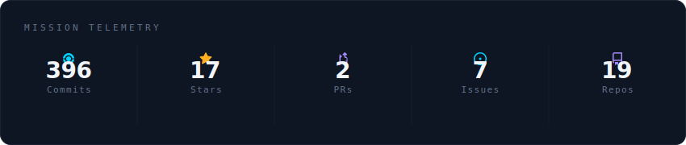

  

 

  

    My name is <b>João Guilherme Butka Zanelato</b>, I'm 20 years old and I'm from Rio Grande do Sul, Brazil. 
    Currently studying <b>Systems Analysis and Development at IFRS</b>. 
    I work as an <b>IT Intern at EMATER/ASCAR-RS</b> and I'm a technology enthusiast focused on <b>SaaS</b>, <b>automation</b>, and <b>scalable architectures</b>.
  

  

    
    
    
    
  

 

  

 

  

 

  

 

  

